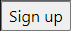
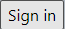
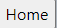
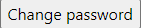
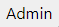
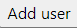

* Lucas Gianinetti (Projet 1) & Nicolas Hungerbühler (Projet 1 et Projet 2) & Dylan Canton (Projet 2)
  ___
  # STI - Projet 1 et 2


  ## Mise en place
  ______

  ### Lancement du serveur et installation de la base de données

  Pour une distribution Linux :
  ```bash
  git clone git@github.com:Grimlix/STI-Projet1.git
  cd STI_Project1/app
  sudo chmod +x setup.sh
  sudo ./setup.sh
  ```

  Pour Windows, il est nécessaire de modifier le fichier **setup_with_path.sh** et d'affecter à la variable path le path du dossier du projet
  ```bash
  git clone git@github.com:Grimlix/STI-Projet1.git
  cd STI-Project1/app
  sudo chmod +x setup_with_path.sh
  sudo ./setup_with_path.sh
  ```
  Il peut avoir une erreur de droit sur le dossier /site. Si c'est le cas il faut lancer cette commande :
    ```bash
  cd STI-Project1/app
  sudo chmod -R 777 /site
  ```
  
  ### Arrêter le serveur 
  ```docker stop sti_project``` 

  ### Supprimer l'image 

  ```docker rm sti_project``` 

  ### Accès au site web

  * addresse : localhost:8080
  * Les différentes pages se trouvent à l'adresse http://localhost:8080/[nom_page], par defaut on tombe sur la page de login.
  * Un administrateur par défaut est inséré dans la base de données :
    * username: admin
    * password: A4UY3AUrAEQs9j%
  * Aucune page ne permet de supprimer un administrateur une fois celui-ci créé. Dans le cas ou il faudrait en supprimer un, il faut :
    * Accéder à la page d'administration de la base de donnée : http://localhost:8080/phpliteadmin.php (Login : admin:admin)
    * Accéder à la table users.
    * Supprimer l'entrée correspondant à l'administrateur non désiré.

  ## Description des différents boutons de navigations
  ___

  * : permet d'aller sur la page de création de compte. Ce bouton se trouve uniquement sur la page de login.
  *  : permet d'aller sur la page de login. Ce bouton se trouve uniquement sur la page de création de compte.

  Les prochains boutons se trouvent tous sur la page principale  qui est en fait la boîte de messages. Ce bouton se trouve dans toutes les pages sauf elle-même et les pages de login et de signup. Elle permet de revenir sur la boîte de messages.

  *  : Permet de se déconnecter

  *  : Permet d'aller sur la page de changement de mot de passe
  *  : Permet d'aller sur la page de création d'un nouveau message.
  *  : Permet d'aller sur la page administrateur où on peut voir les différents collaborateurs et faire des changement. Ce bouton s'affiche uniquement si on est un administrateur. 
  *  : Permet d'aller sur la page pour créer un nouvel utilisateur.


  ## Description des différentes pages
  ___

  ### login.php

  * Page sur laquelle l'utilisateur arrive lorsqu'il n'est pas connecté. Dans le cas ou il essaye d'accéder à une autre page, il est redirigé sur celle-ci.

  * L'utilisateur peut se logger.

  ### sign_up.php

  * L'utilisateur peut créer son compte.

  ### mailbox.php

  * Page sur laquelle l'utilisateur est redirigé après son log in.
  * Cette page affiche les informations des messages reçus par l'utilisateur (et lui permet de :
      * répondre à un message.
      * supprimer un message.
      * accéder au contenu d'un message. 
  * Dans le cas ou cet utilisateur est un administrateur, il peut, en plus des fonctionnalités disponibles à l'utilisateur lambda :
    * accéder à la page pour créer un utilisateur.
    * accéder à la page permettant d'administrer les utilisateurs.

  ### new_message.php

  * Page depuis laquelle un utilisateur peut envoyer un message / répondre à un message.

  ### message_details.php

  * Page sur laquelle le contenu d'un message est affiché.

  ### admin.php

  * Page à laquelle seuls les administrateurs ont accès, une liste de tous les utilisateurs (non administrateur) est affichée.
  * Les administrateurs peuvent :
    * Modifier les données d'un utilisateur :
      * mot de passe
      * rôle (Administrateur/Collaborateur)
      * validité (Enable / Disable)
    * Supprimer un utilisateur.

  ### add_user.php

  * Page à laquelle seuls les administrateurs ont accès.
  * Ils peuvent ajouter un utilisateur (username, password, rôle, validité).
